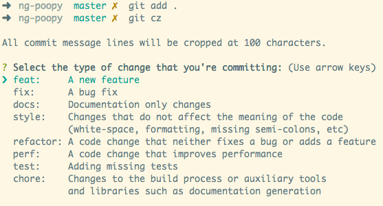

# Modelo de Projeto

Modelo de Projetos e Diretivas

## Pré-Requisitos

Os Pré-Requisitos abaixo deverão ser prenchidos antes de instalar :

1. NodeJS - versão 10 ou superior
2. Yarn - versão 1 ou superior

## Introdução 

Esse projeto é um script que instala e deixa pré-configurado as seguintes ferramentas dentro de um repositório:

- Commit Semântico (através do commitlint, commitzen e husky)
- Changelog automático (através do standard-version)

## Script de instalação 

Para fazer a instalação você deve executar o script abaixo na pasta raiz do seu repositório:

```bash
curl https://raw.githubusercontent.com/projetos-de-software/modelo/main/script/install.sh -o install.sh
```

```bash
sh install.sh
```

## Uso da ferramenta

Os passos abaixo são para que o usuário tenha pleno uso das funcionalidades:  

### Como fazer um commit

Primeiro você deverá adicionar através do commando abaixo:

```bash
git add . 
```

Você pode escolher os arquivos. O ponto acima é apenas um exemplo. 

O segundo passo é executar o commitzen através do seguinte commando: 

```bash
yarn commit
```

Esse commando acionará o commitzen para que você usufrua da padronização de mensagens. Você pode ler mais sobre o [Commits Convencionais](docs/04%20-%20Commit%20Convecional.md).



Ao final é só efetuar o push através do commando: 

```bash
git push
```

### Como gerar changelogs

Em primeiro lugar você poderá configurar o que aparece nos changelogs modificando o arquivo .versionrc.

Para gerar o primeiro changelog é necessário rodar o comando abaixo:

```bash
yarn release --first-release
```

Para gerar os próximos:

```bash
yarn release
```

## Documento

| Número |                     Descrição e Link                      |
| :----: | :-------------------------------------------------------: |
|   01   | [Diretrizes Gerais](docs/01%20-%20Diretrizes%20Gerais.md) |
