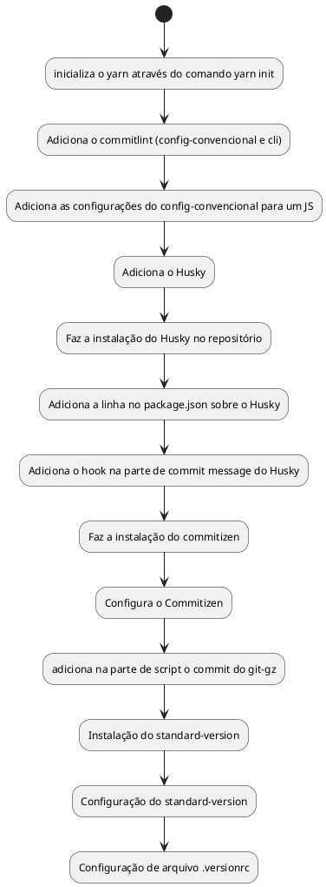

# Install Script 

## Diagrama de Atividade

### Commitlint

Para exigir que as regras do [Commit Convencional](https://www.conventionalcommits.org/pt-br/v1.0.0/) sejam aplicadas precisamos instalar um interpretador (linter) para que as mensagens de commit sejam interpretadas.

Faz parte das dependências desse projeto o @commitlint/config-conventional e o @commitlint/cli

O primeiro pacote especifica que iremos utilizar as [configurações convencionais](04%20-%20Commit%20Convecional.md) e o segundo pacote é um interpretador de linha de comando. 

### Husky

O Husky é um pacote que oferece os hooks do git sem muito trabalho. Ele é simples e leve, além de muito fácil de mexer. 

### Commitizen 

O Commitizen é um dos pacotes que atuam em linha de comando para forçar o usuário a seguir as diretrizes do commit convencional. Através de 3 passos, ele direciona o commit para que ele siga exatamente as diretrizes convencionais.

### Standard Version

O Standard Version é um pacote para geração de changelog. Isso é uma mão na roda para gerar documentação e é uma das pontas do processo sobre os motivos que geramos commits convencionais e versionamento semântico. 

## Tarefas pré-instalação

- Checar se os comandos existem no sistema operacional alvo
  - npm
  - node
  - yarn

- checar as versões de cada um.

## Tarefas auxiliares

